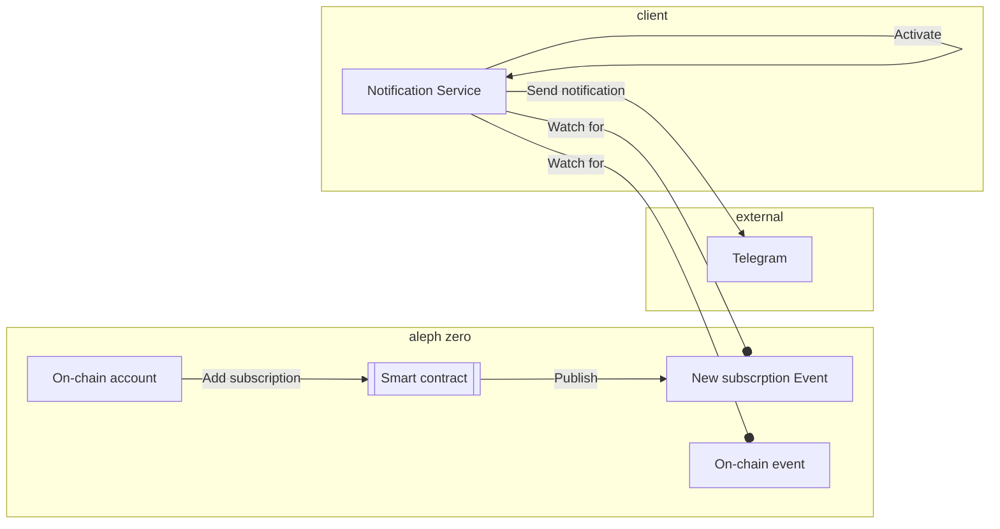
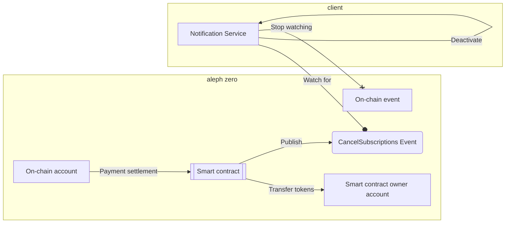

Aleph Zero notifications and subscriptions
==========================================

This project is a `notification-service` that sends notifications about events on the **Aleph Zero** chain to subscribed on-chain accounts.
Notifications are sent to various channels, including Telegram.
Subscriptions are managed by on-chain smart contract, while notifications are managed by an off-chain service.
The notification service subscribes to events from:
* smart contract (see architecture below)
* on-chain events, e.g. Transfer, Rewarded.
The notification service sends notifications about on-chain events to external channels, e.g. Telegram.
The `Subscriptions` smart contract allows to register a new subscription, cancel a subscription, and payment settlement for payment intervals.

Note #1: this project is being developed as part of the hackathon [Aleph Zero Hackathon](https://techfiesta.dev/techfiestas/9/aleph-zero-hackathon).

Note #2: this project won the Techfiesta hackathon [The winners of Aleph Zero hackathon](https://twitter.com/techFiesta_hack/status/1740655723506479426)

# Structure

This repository contains 2 sub-projects:

1. [Subscriptions smart contract](./contracts/subscriptions/README.md)
2. [Notification service](./notification-service/README.md)

# Architecture

The notification service is a client of the aleph zero blockchain. It subscribes to events published on the chain and sends notifications to channels such as Telegram.
Notifications are sent only to registered users. The subscription model (regular payments) is used to keep this serivce maintainable. 

A user represented as an on-chain account can add a new subscribtion using a smart contract. 
The validated subscription is registerred in the smart contract and the declared n-month fee is reserved.
A new subscription event is published on-chain. The notification service (client of the chain) listens for such events and activates new subscription.
For each declared on-chain event, the notification service sends a message to the external channel indicated by the user.
Each month, the smart contract owner sings a transaction to transfer an appropriate part of the n-monthly fee. 

A user represented as an on-chain account can cancel the subscription using a smart contract.
The smart contract returns the remaining fee to the user's account.
A cancellation event is published on-chain. The notificatin service listens for such events and deactives the subscription.

Payment settlement is made periodically on the Subscriptions smart contract by an authorized user (typically smart contract owner). 
For each active subscription, if a sufficient number of tokens are reserved, a periodic payment is made (tokens for one payment interval are transferred from the smart contract to the contract owner). 
If the are no more reserved tokens for the next payment internal, the subscription is cancelled and becomes part of the `CancelledSubscriptions` event.
The notification service automatically removes canceled subscriptions and stops sending notifications for them.

