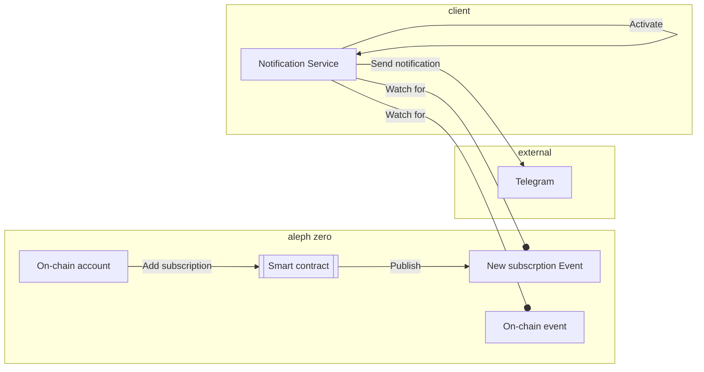
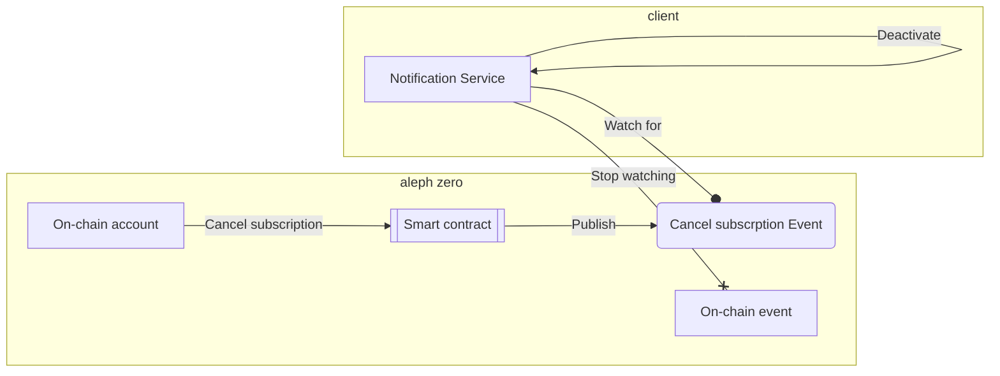

Aleph Zero notifications and subscriptions
==========================================

This project is a `notification-service` that sends notifications about events on the **Aleph Zero** chain to subscribed on-chain accounts.
Notifications are sent to various channels, including Telegram.

Note: this project is being developed as part of the hackaton [Aleph Zero Hackaton](https://techfiesta.dev/techfiestas/9/aleph-zero-hackathon).

# Structure

This repository contains 2 sub-projects:

1. [Notification service](./notification-service/README.md)
2. [Subscriptions smart contract](./contracts/subscriptions/README.md)

# Architecture

The notification service is a client of the aleph zero blockchain. It subscribes to events published on the chain and sends notifications to channels such as Telegram.
Notifications are sent only to registered users. The subscription model (regular payments) is used to keep this serivce maintainable. 

A user represented as an on-chain account can add a new subscribtion using a smart contract. 
The validated subscription is registerred in the smart contract and the declared n-month fee is reserved.
A new subscription event is published on-chain. The notification service (client of the chain) listens for such events and activates new subscription.
For each declared on-chain event, the notification service sends a message to the external channel indicated by the user.
Each month, the smart contract owner sings a transaction to transfer an appropriate part of the n-monthly fee. 

A user represented as an on-chain account can cancel the subscription using a smart contract.
The smart contract returns the remaining fee to the user's account.
A cancellation event is published on-chain. The notificatin service listens for such events and deactives the subscription.

