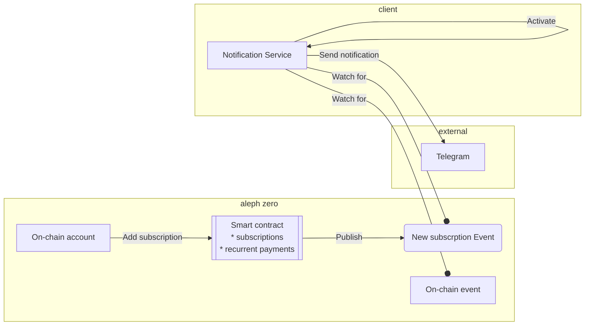
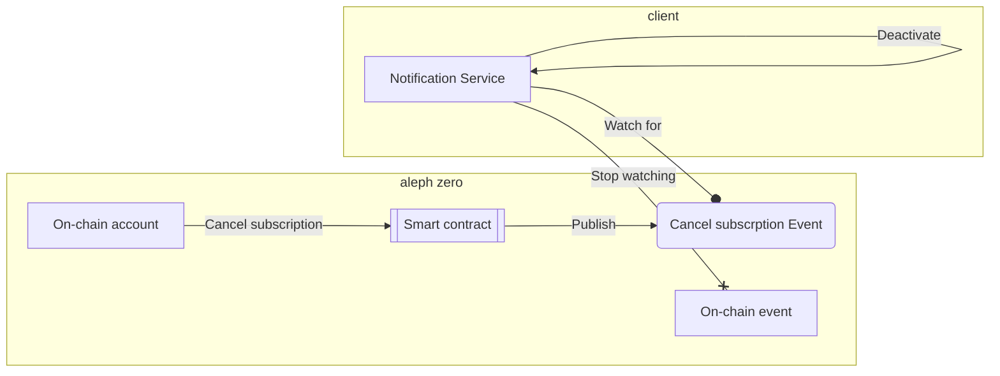

Aleph zero notification service
===============================

`notification_service` is `Aleph Zero` network client that subscribes to events and sends notification to variaty of channels (e.g. Telegram).

This project is being developed as part of the hackaton [Aleph Zero Hackaton](https://techfiesta.dev/techfiestas/9/aleph-zero-hackathon).

# Repository structure

This repository contains:

* `cli.rs` - command line application interface. Use `-h` option for the list of available commands.
* `events.rs` - aleph node event subscriber
* `notifications` - event notification channels, e.g. Telegram
* `Makefile` - helper commands used to build and test application. Use `make help` for the list of available commands

# Setup

## Prerequisites

### `rustup` installation 

	$ curl --proto '=https' --tlsv1.2 -sSf https://sh.rustup.rs | sh
	$ source ~/.cargo/env

## Building and testing

The application is built using the `--release` flag to minimize the size of the binary.

	$ make build

	$ make test

## Telegram bot configuration

Telegram requires bot to be configured for using Telegram REST API. In order to create a new bot use [@Botfather](https://t.me/botfather) the the format `123456789:aaaabbbbcccc`.

Find the Telegram `chat_id` or `group_chat_id` where notifications will be sent. In a future version, this feature will be dynamically configured as a part of subscription procedure.

## Usage scenarios

### Send Transfer event notification to the Telegram channel

Send notifications about transfer event to the Telegram channel

	$ cargo run --release -- -n wss://ws.test.azero.dev:443 transfer-event -a 5GRkePp3CqPJXkfbt52G4XdZp4Pi4oQaHyERNrFX6fxB73HU telegram -t <bot token> -c <channel id>

# Architecture

The notification service is a client of the aleph zero blockchain. It subscribes to events published on the chain and sends notifications to channels such as Telegram.
Notifications are sent only to registered users. The subscription model (regular payments) is used to keep this serivce maintainable. 

A user represented as an on-chain account can add a new subscribtion using a smart contract. 
The validated subscription is registerred in the smart contract and the declared n-month fee is reserved.
A new subscription event is published on-chain. The notification service (client of the chain) listens for such events and activates new subscription.
For each declared on-chain event, the notification service sends a message to the external channel indicated by the user.
Each month, the smart contract owner sings a transaction to transfer an appropriate part of the n-monthly fee. 

A user represented as an on-chain account can cancel the subscription using a smart contract.
The smart contract returns the remaining fee to the user's account.
A cancellation event is published on-chain. The notificatin service listens for such events and deactives the subscription.

