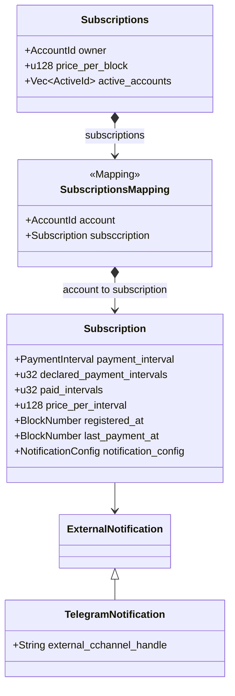

Subscription smart contract for the aleph-notification service
==============================================================

`subscriptions` is a contract that allows users to subscribe for aleph zero chain events and get notified via variaty of channels (e.g. Telegram).

# Repository structure

This repository contains only main directory with:

* `lib.rs` - smart contract implementation plus unit tests
* `rust-toolchain.toml` - the version of Rust used to build this smart contract

# Setup

## Prerequisites

Before building the contract, make sure you have `rustup` and `cargo contracts` installed.

### `rustup` installation 

	$ curl --proto '=https' --tlsv1.2 -sSf https://sh.rustup.rs | sh
	$ source ~/.cargo/env

### `cargo contracts` installation

* `cargo-contract` compatible with Aleph Zero `r-12.1` version: `cargo install cargo-contract --version 2.0.1 --force --lock`

Compatible Rust version: `1.68.0` `+nightly` is defined in `rust-toolchain.toml` together with required components, e.g. `rust-src`.
Compatible Ink! version: `4.2.1`.
Compatible Scale version: `2.3`.

## Building and testing smart contract

The smart contract is built using the `--release` flag to minimize the size of the binary WASM file.
Execute below commands from the main directory

	$ make build-contracts

	$ make test-contracts
  
## Deploying smart contract

Any wallet connected to the Aleph Zero network compatible with the Ink! version 4.0.1 can be used. 
Or local Aleph Zero network can be used with the following deployment command:

	$ cargo contract instantiate --args 10  --suri //Alice ./contracts/subscriptions/target/ink/subscriptions.contract	
	
The smart contract constructor requires to pass a price per block (AZERO tokens). 
Each payment interval is converted into a number of blocks corresponding to the token value.

# Architecture

The `Subscriptions` smart contract allows to subscribe to on-chain event notifications, e.g. Rewarded nominator event.
In the base version, the subscriber declares the length of the subscriptions periods (e.g. n-weeks), and the contract owner starts payment settlements on regular basis.
The subscriber must provide a tokens sufficient to pay for the declared subscription period. The token value is transferred to the smart contract.
When a subscriber cancels subscription, the remaining tokens will be returned to the subscriber's account.
In a future version, the contract will notify the subscriber to accept payment for the next period. Then subscriber will keep their tokens in their wallets.

## Storage model

The smart contract storage model consists of:

* `owner` - the account that instantiated the smart contract
* `price_per_block` - price per per block, which can be translated to a payment interval, e.g. WEEK, or MONTH
* mapping of registered accounts to the subscription details
* list of active subscriptions represented by a vector of registerred and active accounts

Subscription represents an account subscribed to notifications of on-chain events for a limited time period. 
The smart contract is responsible for settling recurring payments. 

## Constructors

`new()` with `price_per_block` creates a new instance of this smart contract with empty list of subscriptions and a defined price per block,
 which is translated for a price per interval, e.g.a week or month.

## Messages

`add_subscription()` registers a new subscrption for the caller and the given payment interval.

`cancel_subscription()` cancels the subscription associated with the caller.

`get_active_subscriptions()` retrieves a list of active subscriptions.

`payment_settlement()` starts the settlement of payments for the next subscription round. Only current owner of the smart contract is allowed to call this function.

`transfer_ownership()` transfers ownership to th new owner. Only current owner of the smart contract is allowed to call this function.

## Events

`EventSubscription` - emitted when a new subscription is added.

`CancelledSubscription` - emitted when subscription is canceled.

`CancelledSubscriptions` - emitted when payment settlement cancels active subscriptions, typically when subscriptions run out of tokens to pay for subsequent intervals.